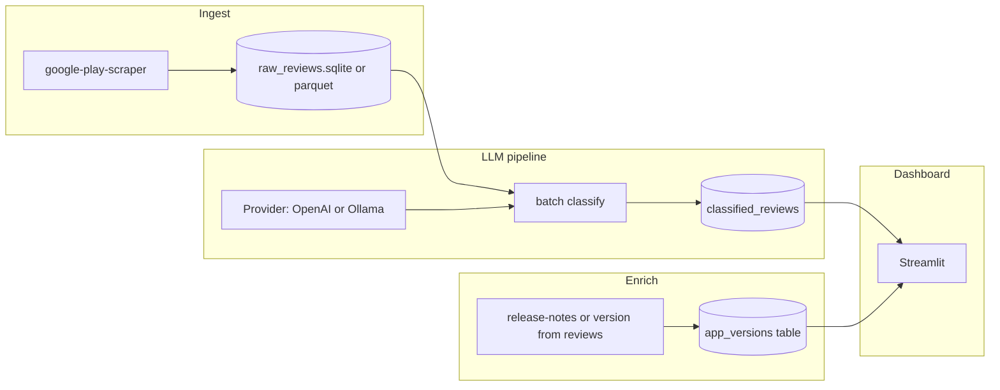

# Plan: Intelligent app-feedback monitor (PPR05 alignment)

## What the PDF asks for

From [PPR05.2526.ESTG (1).pdf](</Users/enlt-rferraz/Desktop/Projeto%20ESTG%2026/PPR05.2526.ESTG%20(1).pdf>):

- **Scraping**: automated extraction of reviews + metadata (you chose **Google Play** for the first version).
- **LLM NLP**: system prompting to assign **sentiment**, **predefined topic categories**, and a **short justification** per review.
- **Evolution**: relate sentiment/topics to **app version / release history**.
- **Dashboard**: filter by version; show qualitative summaries and category evolution.
- **Validation**: measure **accuracy** of LLM labels against a **hand-labeled test set**.

Your workspace `[Project/scrapping](/Users/enlt-rferraz/Desktop/Projeto%20ESTG%2026/Project/scrapping)` currently has **no application source** (only `.git` and a `venv` with Streamlit), so this is a **greenfield** implementation on top of that environment.

## Recommended architecture

## Technical choices (and alternatives)

| Area       | Default choice                                                                                        | Alternatives                                                                                       |
| ---------- | ----------------------------------------------------------------------------------------------------- | -------------------------------------------------------------------------------------------------- |
| Play data  | Python `[google-play-scraper](https://github.com/JoMingyu/google-play-scraper)` (no official API key) | Official Play Developer API (needs dev account + app ownership); manual CSV export for a tiny demo |
| Storage    | **SQLite** + SQLAlchemy (simple, report-friendly)                                                     | DuckDB/Parquet if volume grows                                                                     |
| LLM access | **Provider interface** + env config: OpenAI-compatible API **and** Ollama HTTP                        | Only one provider if you want less code                                                            |
| Dashboard  | **Streamlit** (already in venv)                                                                       | Dash/Reflex if you need more custom UI later                                                       |
| Evaluation | JSONL gold set + script for precision/recall/F1                                                       | Confusion matrix in notebook or Streamlit page                                                     |

**Compliance note**: scraping may conflict with store ToS; for the thesis, document assumptions, rate limits, and ethical use (public reviews only, attribution). Prefer conservative request spacing and caching.

## Implementation phases

### Phase 1 — Data collection and schema

- Add project layout under the repo root, e.g. `src/`, `data/`, `scripts/`, `[requirements.txt](requirements.txt)` (or `pyproject.toml`).
- Implement a **Play scraper module** (e.g. `[src/scraping/play-store.py](src/scraping/play-store.py)` or package `scraping/play_store.py` if you avoid hyphens in module names: `**play_store.py`** in kebab-case folder `app-feedback-monitor` is awkward—use `**src/scraping/play_store.py\*\`inside package`scraping`).
- Persist: review id, text, rating, date, language, **reviewer app version** (when available), thumbs, reply, etc.
- **Version / releases**: many reviews include an app version string; use that as the primary join key. Optionally add a small **release-notes fetcher** later (HTML is brittle—treat as optional stretch).

### Phase 2 — LLM classification pipeline

- Define a **fixed taxonomy** of topics (YAML or Python enum) shared by prompts and dashboard.
- **System + user prompts** requesting **strict JSON** output, e.g. `{ "sentiment": "...", "topics": [...], "justification": "..." }` with validation (Pydantic).
- **Provider abstraction** (e.g. `[src/llm/providers/base.py](src/llm/providers/base.py)`, `openai_client.py`, `ollama_client.py`) driven by env vars (`LLM_PROVIDER=openai|ollama`, base URL, model name, API key).
- **Batching, retries, idempotency**: store raw model JSON per `review_id` to avoid re-spend; optional `--limit` for demos.

### Phase 3 — Evolution / correlation

- Aggregate by **version** (and optionally by week): counts of sentiment, topic distribution, average rating.
- Simple **“what changed after version X”** view: compare two versions (delta tables or small narrative summary generated once per pair via LLM—optional).

### Phase 4 — Streamlit dashboard

- Entrypoint e.g. `[dashboard/app.py](dashboard/app.py)` or `[streamlit_app.py](streamlit_app.py)`: selectors for app package id, date range, version, sentiment, topic; charts (Plotly/Altair); table of reviews with justification.
- **Qualitative summaries**: optional cached LLM summary per version (generate on demand or nightly job).

### Phase 5 — Validation (thesis requirement)

- Build a **gold dataset** (~100–300 reviews): human labels for sentiment + topics.
- Script to run the same pipeline on that set and compute **accuracy / macro-F1 / per-class metrics**; export figures for the report.

## Deliverables checklist (mapping to PDF)

- Scraping automation + documented run command.
- LLM pipeline with **prompts** and **reproducibility** (model names, temperature, seed if applicable).
- DB with version fields and aggregates.
- Interactive dashboard with version filters.
- Evaluation notebook or script + results vs gold set.

## Suggested first concrete milestone

After dependencies are pinned: one command to **scrape N reviews** for a chosen `package_name` into SQLite, and one command to **classify** the first 20 rows with **Ollama** or **OpenAI** using the shared JSON schema—then wire Streamlit read-only views.
