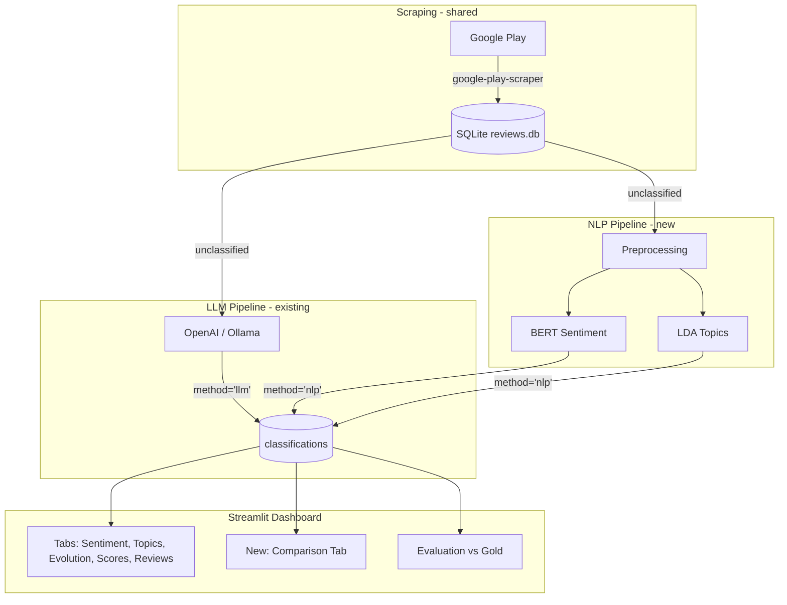

# NLP Pipeline and Comparison Dashboard

## Context

The PDF project spec (**PPR06**) requires a platform that uses **traditional NLP** for app review analysis:

- **BERT** for sentiment classification (positive / negative / neutral)
- **LDA** (Latent Dirichlet Allocation) for unsupervised topic discovery
- Evolution module correlating sentiment with app versions
- Dashboard with comparison capabilities
- Validation against manually annotated reviews

The current codebase already has an **LLM-based approach** (OpenAI/Ollama). The goal is to build the real project (BERT + LDA) and turn the app into a comparison tool for both approaches.

---

## Architecture



---

## 1. Database Schema Update

**File:** [src/db/models.py](src/db/models.py)

- Add `method` column (String, default `"llm"`) to `Classification`
- Change unique constraint from `(review_id)` to `(review_id, method)` so both pipelines can store results for the same review
- Add `lda_topic_id` (Integer, nullable) and `lda_topic_words` (String, nullable) columns for LDA-discovered topic metadata
- Write an Alembic-free migration script (`scripts/migrate_db.py`) that adds the new columns to existing data and backfills `method='llm'` for existing rows

```python
class Classification(Base):
    __tablename__ = "classifications"
    __table_args__ = (
        UniqueConstraint("review_id", "method", name="uq_classification_review_method"),
    )
    # ... existing columns ...
    method = Column(String, nullable=False, default="llm")
    lda_topic_id = Column(Integer, nullable=True)
    lda_topic_words = Column(String, nullable=True)
```

---

## 2. NLP Pipeline (new `src/nlp/` package)

### 2a. Text Preprocessing - `src/nlp/preprocessing.py`

- Lowercase, strip HTML/URLs/emojis
- Remove stopwords (Portuguese + English via NLTK)
- Lemmatization with spaCy `pt_core_news_sm` (or fallback to simple stemming)
- Return both cleaned text (for BERT) and tokenized list (for LDA)

### 2b. BERT Sentiment - `src/nlp/sentiment.py`

- Use `nlptown/bert-base-multilingual-uncased-sentiment` from HuggingFace (supports Portuguese, outputs 1-5 stars)
- Map star predictions to sentiment: 1-2 = negative, 3 = neutral, 4-5 = positive
- Batch inference for efficiency
- Returns sentiment label + confidence score

### 2c. LDA Topic Modeling - `src/nlp/topics.py`

- Use `sklearn.decomposition.LatentDirichletAllocation` (sklearn is already a dependency)
- `sklearn.feature_extraction.text.CountVectorizer` for bag-of-words
- Configurable number of topics (default 8, tunable)
- Store per-review: dominant topic ID + top words for that topic
- Map LDA topics to the fixed taxonomy using keyword overlap heuristic (best-effort, for comparison)
- Provide `fit_lda()` (train on corpus) and `predict_topics()` (assign to reviews)

### 2d. Pipeline Orchestrator - `src/nlp/pipeline.py`

- `classify_batch_nlp(limit, app_id)` mirrors the LLM's `classify_batch()`
- Loads unclassified-by-NLP reviews from DB
- Runs preprocessing, BERT sentiment, LDA topics
- Stores results in `classifications` with `method='nlp'`

---

## 3. New CLI Script - `scripts/classify_nlp.py`

- Mirrors `scripts/classify.py` but calls the NLP pipeline
- Args: `--limit`, `--app-id`, `--num-topics` (LDA), `--retrain-lda`
- First run trains and persists the LDA model; subsequent runs reuse it (pickle in `data/`)

---

## 4. Config Updates - `src/config.py`

- Add NLP-related settings:
  - `BERT_MODEL` (default `nlptown/bert-base-multilingual-uncased-sentiment`)
  - `LDA_NUM_TOPICS` (default `8`)
  - `LDA_MODEL_PATH` (default `data/lda_model.pkl`)
  - `NLP_BATCH_SIZE` (default `32`)

---

## 5. Query Layer Updates - `src/db/queries.py`

- All existing queries gain an optional `method` parameter (default `None` = both)
- New queries:
  - `get_reviews_df(app_id, method)` - filter by classification method
  - `sentiment_comparison(app_id)` - side-by-side sentiment counts for LLM vs NLP
  - `agreement_rate(app_id)` - percentage of reviews where both methods agree
  - `topic_comparison(app_id)` - LDA topics vs LLM taxonomy topics

---

## 6. Dashboard Updates - `streamlit_app.py`

- **Sidebar:** Add a "Classification method" radio button: `LLM`, `NLP`, `Both (comparison)`
  - When `LLM` or `NLP` selected: existing tabs filter to that method
  - When `Both` selected: unlock the Comparison tab
- **New "Comparison" tab** (inserted between Evolution and Score Analysis):
  - Side-by-side sentiment distribution (LLM vs NLP pie charts)
  - Agreement matrix heatmap (LLM sentiment x NLP sentiment)
  - Per-version sentiment agreement line chart
  - Topics: LLM taxonomy bar chart vs LDA word-cloud / cluster visualization
  - Metrics summary: agreement %, Cohen's kappa
- **Topics tab update:** When NLP selected, show LDA-discovered topics as word groups with bar charts of prevalence. When LLM selected, show existing fixed taxonomy view.
- **Reviews tab update:** Show both LLM and NLP classifications side-by-side in each review card when both exist.

---

## 7. Evaluation Updates - `scripts/evaluate.py`

- Add `--method` flag (`llm`, `nlp`, `both`)
- When `both`: run evaluation for each method separately and print a comparison table
- Sentiment evaluation works directly (both produce positive/negative/neutral)
- Topic evaluation: only for LLM (since LDA topics are unsupervised and don't map 1:1 to gold labels) - note this in the output

---

## 8. Dependencies - `requirements.txt`

Add:

- `transformers>=4.40.0` (BERT model loading)
- `torch>=2.2.0` (PyTorch backend for transformers)
- `nltk>=3.8.0` (stopwords, tokenization)
- `wordcloud>=1.9.0` (topic visualization in dashboard)
- `joblib>=1.4.0` (LDA model persistence)

Note: `spaCy` + `pt_core_news_sm` could be added for better Portuguese lemmatization, but NLTK stemming is simpler and sufficient for LDA.

---

## 9. Migration Script - `scripts/migrate_db.py`

- Handles existing databases gracefully (adds columns if missing)
- Backfills `method='llm'` on all existing classification rows
- Drops old unique constraint, creates new composite one
- Idempotent (safe to run multiple times)

---

## File Summary

| Action | File                                                                      |
| ------ | ------------------------------------------------------------------------- |
| Modify | `src/db/models.py`, `src/db/queries.py`, `src/config.py`                  |
| Modify | `streamlit_app.py`, `scripts/evaluate.py`, `requirements.txt`             |
| Create | `src/nlp/__init__.py`, `src/nlp/preprocessing.py`, `src/nlp/sentiment.py` |
| Create | `src/nlp/topics.py`, `src/nlp/pipeline.py`                                |
| Create | `scripts/classify_nlp.py`, `scripts/migrate_db.py`                        |
