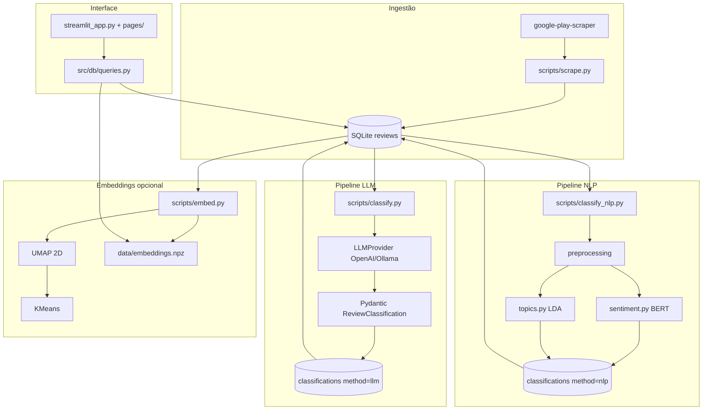
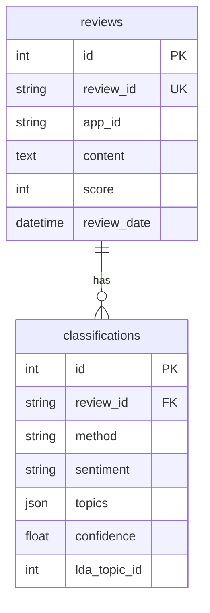

# App Feedback Monitor — Guia Técnico

Documentação de arquitetura, modelos de dados, pipelines e decisões de implementação. Para uso operacional (comandos, dashboard, passo a passo), ver [README.md](README.md) e [APP_GUIDE.md](APP_GUIDE.md).

---

## Índice

1. [Visão geral](#1-visão-geral)
2. [Stack e dependências](#2-stack-e-dependências)
3. [Arquitetura](#3-arquitetura)
4. [Estrutura do repositório](#4-estrutura-do-repositório)
5. [Configuração (`src/config.py`)](#5-configuração-srcconfigpy)
6. [Base de dados](#6-base-de-dados)
7. [Pipeline de scraping](#7-pipeline-de-scraping)
8. [Pipeline LLM](#8-pipeline-llm)
9. [Pipeline NLP (BERT + LDA)](#9-pipeline-nlp-bert--lda)
10. [Pipeline de embeddings](#10-pipeline-de-embeddings)
11. [Camada de queries (`src/db/queries.py`)](#11-camada-de-queries-srcdbqueriespy)
12. [Dashboard Streamlit](#12-dashboard-streamlit)
13. [Avaliação (gold dataset)](#13-avaliação-gold-dataset)
14. [Migração de base de dados](#14-migração-de-base-de-dados)
15. [Ficheiros em `data/`](#15-ficheiros-em-data)
16. [Testes](#16-testes)
17. [Concorrência, cache e limitações técnicas](#17-concorrência-cache-e-limitações-técnicas)
18. [Pontos de extensão](#18-pontos-de-extensão)

---

## 1. Visão geral

O projeto implementa um **monitor de feedback de apps móveis** com duas pipelines de classificação independentes sobre o mesmo corpus de avaliações da Google Play:

| Pipeline | `method` na BD | Sentimento | Tópicos |
|----------|------------------|------------|---------|
| LLM | `llm` | Prompt + JSON validado (Pydantic) | Taxonomia fixa (10 tópicos) |
| NLP | `nlp` | BERT `nlptown/bert-base-multilingual-uncased-sentiment` (1–5 estrelas → 3 classes) | LDA não supervisionado + mapeamento heurístico para a mesma taxonomia |

Um terceiro fluxo opcional gera **embeddings BERT** (mean-pool), redução **UMAP** 2D e **KMeans** para exploração visual no dashboard.

Não existe servidor HTTP próprio: tudo corre como **scripts CLI** (`python -m scripts.*`) ou **Streamlit** (`streamlit run streamlit_app.py`).

---

## 2. Stack e dependências

| Camada | Tecnologia | Versão mínima (requirements) |
|--------|------------|------------------------------|
| Linguagem | Python | 3.10+ |
| Scraping | `google-play-scraper` | ≥ 1.2.7 |
| LLM | `openai` SDK (OpenAI + Ollama `/v1`) | ≥ 1.30.0 |
| Validação LLM | `pydantic` | ≥ 2.7.0 |
| NLP | `transformers`, `torch`, `nltk`, `joblib` | ver `requirements.txt` |
| BD | SQLite + SQLAlchemy 2.x ORM | ≥ 2.0.30 |
| Dashboard | `streamlit`, `plotly`, `pandas`, `wordcloud` | — |
| Avaliação | `scikit-learn` | ≥ 1.5.0 |
| Embeddings | `umap-learn`, `matplotlib` | UMAP ≥ 0.5.6 |
| Testes | `pytest`, `pytest-mock` | ≥ 8.0.0 |

**Armazenamento em disco (típico):**

- PyTorch + pesos BERT: ~3 GB (primeira execução NLP/embed)
- `data/reviews.db`: SQLite (gitignored)
- `data/lda_model.pkl`: vectorizer + LDA serializados
- `data/embeddings.npz`: vetores + UMAP + clusters

---

## 3. Arquitetura



**Princípios de desenho:**

- Uma linha em `reviews` por avaliação (`review_id` único).
- Até duas linhas em `classifications` por avaliação (`UNIQUE(review_id, method)`).
- Taxonomia de sentimentos/tópicos partilhada (`src/llm/taxonomy.py`) para comparabilidade LLM vs NLP.
- Modelos ML carregados em **singleton lazy** (módulo global) para evitar reload entre batches.

---

## 4. Estrutura do repositório

```
scrapping/
├── streamlit_app.py          # Dashboard principal (comparação LLM/NLP)
├── pages/
│   ├── about.py              # Ajuda in-app
│   ├── labeling.py           # Etiquetagem gold → data/gold.jsonl
│   └── pipeline_control.py   # Lança scripts via subprocess + threads
├── scripts/                  # Entry points CLI (python -m scripts.<nome>)
├── src/
│   ├── config.py             # Paths, env, defaults
│   ├── db/
│   │   ├── models.py         # ORM + engine SQLite
│   │   └── queries.py        # SQL + cache Streamlit
│   ├── llm/                  # Classificação generativa
│   ├── nlp/                  # BERT, LDA, embeddings
│   └── scraping/
│       └── play_store.py
├── tests/                    # pytest (BD em memória, mocks)
├── data/                     # Artefactos runtime (gitignored exceto example)
├── requirements.txt
├── .env.example
├── README.md                 # Referência de comandos (EN)
├── APP_GUIDE.md              # Guia de utilizador (PT)
└── technical-guide.md        # Este documento
```

**Convenção de imports:** os scripts adicionam a raiz ao `PYTHONPATH` implicitamente quando executados com `python -m scripts.*` a partir da raiz do projeto. O `pipeline_control` define `PYTHONPATH=<root>` nos subprocessos.

---

## 5. Configuração (`src/config.py`)

Carrega `.env` via `python-dotenv` no import do módulo.

| Constante | Origem env | Default | Uso |
|-----------|------------|---------|-----|
| `ROOT_DIR` | — | pai de `src/` | Caminhos absolutos |
| `DATA_DIR` | — | `ROOT_DIR/data` | BD, LDA, embeddings |
| `DATABASE_URL` | — | `sqlite:///.../reviews.db` | SQLAlchemy |
| `LLM_PROVIDER` | `LLM_PROVIDER` | `openai` | Factory em `classifier.get_provider` |
| `OPENAI_*`, `OLLAMA_*` | env | ver `.env.example` | Providers |
| `BERT_MODEL` | `BERT_MODEL` | `nlptown/bert-base-multilingual-uncased-sentiment` | Sentimento + tokenizer embeddings |
| `LDA_NUM_TOPICS` | `LDA_NUM_TOPICS` | `8` | `LatentDirichletAllocation.n_components` |
| `LDA_MODEL_PATH` | — | `data/lda_model.pkl` | joblib |
| `NLP_BATCH_SIZE` | `NLP_BATCH_SIZE` | `32` | Inferência BERT |
| `DEFAULT_APP_ID`, `SCRAPE_*` | env | `com.whatsapp`, `pt` | Defaults CLI scrape |

`ensure_data_dir()` cria `data/` sob demanda (scrape, init_db, save embeddings).

`_int_env()` valida inteiros nas variáveis numéricas e lança `ValueError` descritivo se inválido.

### 5.1 Arranque do GPT (OpenAI) e do Ollama

O factory `get_provider()` em `src/llm/classifier.py` lê `LLM_PROVIDER` (ou `--provider` no CLI / dropdown no Streamlit).

**OpenAI (GPT)**

```env
LLM_PROVIDER=openai
OPENAI_API_KEY=sk-...
OPENAI_MODEL=gpt-4o-mini
```

- Cliente: `OpenAIProvider` → SDK `openai.OpenAI(api_key=OPENAI_API_KEY)`.
- Teste: `python -m scripts.classify --limit 5`.

**Ollama (local)**

1. Instalar e arrancar: [ollama.com](https://ollama.com) — `ollama serve` ou app desktop.
2. Modelo: `ollama pull llama3` (ou outro alinhado com `OLLAMA_MODEL`).
3. `.env`:

```env
LLM_PROVIDER=ollama
OLLAMA_BASE_URL=http://localhost:11434
OLLAMA_MODEL=llama3
```

- Cliente: `OllamaProvider` → mesmo SDK OpenAI com `base_url={OLLAMA_BASE_URL}/v1` e `api_key="ollama"` (compatível com API OpenAI do Ollama).
- Teste: `python -m scripts.classify --provider ollama --limit 5`.
- Verificação rápida: `GET {OLLAMA_BASE_URL}/api/tags`.

**IAEDU (agent-chat)**

```env
LLM_PROVIDER=iaedu
IAEDU_API_KEY=sk-usr-...
IAEDU_CHANNEL_ID=...
IAEDU_ENDPOINT=https://api.iaedu.pt/agent-chat/api/v1/agent/.../stream
```

- Cliente: `IaeduProvider` em `src/llm/providers/iaedu_client.py` — `httpx` POST multipart (`channel_id`, `thread_id`, `user_info`, `message`) + header `x-api-key`.
- System + user prompt fundidos num único `message` (a API não tem roles separados).
- Resposta: leitura do body stream/SSE; parser em `_parse_stream_body`.
- `thread_id` novo por chamada (`secrets.token_urlsafe`).

**Streamlit:** `pages/pipeline_control.py` passa `--provider` ao subprocesso (`openai` | `ollama` | `iaedu`).

---

## 6. Base de dados

### 6.1 Motor e sessões

- **Motor:** SQLAlchemy `create_engine(DATABASE_URL, echo=False)`
- **Sessões:** `sessionmaker` → `get_session()`
- **Bootstrap:** `init_db()` → `Base.metadata.create_all(engine)`

### 6.2 Tabela `reviews`

| Coluna | Tipo | Notas |
|--------|------|-------|
| `id` | INTEGER PK | autoincrement |
| `review_id` | VARCHAR UNIQUE INDEX | ID Google Play |
| `app_id` | VARCHAR INDEX | package name |
| `username` | VARCHAR | opcional |
| `content` | TEXT NOT NULL | texto da avaliação |
| `score` | INTEGER | 1–5 estrelas na loja |
| `thumbs_up` | INTEGER | default 0 |
| `app_version` | VARCHAR INDEX | versão reportada |
| `review_date` | DATETIME | |
| `language` | VARCHAR | do scraper |
| `reply_content`, `reply_date` | TEXT/DATETIME | resposta do developer |
| `scraped_at` | DATETIME | UTC, default `_utcnow()` |

### 6.3 Tabela `classifications`

| Coluna | Tipo | Notas |
|--------|------|-------|
| `id` | INTEGER PK | |
| `review_id` | FK → `reviews.review_id` | |
| `method` | VARCHAR | `llm` ou `nlp` |
| `sentiment` | VARCHAR NOT NULL | taxonomia partilhada |
| `confidence` | FLOAT | só NLP (softmax BERT) |
| `topics` | JSON | lista de strings taxonomia |
| `justification` | TEXT | só LLM |
| `model_name` | VARCHAR | ex. `gpt-4o-mini` ou HF model id |
| `raw_response` | TEXT | LLM: JSON serializado Pydantic |
| `lda_topic_id` | INTEGER | só NLP |
| `lda_topic_words` | VARCHAR | top words LDA, CSV |
| `classified_at` | DATETIME UTC | |

**Constraint:** `UNIQUE(review_id, method)` — permite LLM e NLP na mesma avaliação.

### 6.4 Diagrama ER



---

## 7. Pipeline de scraping

**Módulo:** `src/scraping/play_store.py`  
**CLI:** `python -m scripts.scrape`

### Fluxo

1. `reviews()` do `google-play-scraper` em batches de `min(count, 200)` com `continuation_token`.
2. Pausa `time.sleep(1)` entre batches.
3. Trunca à lista `--count`.
4. Filtra avaliações com `len(content.strip()) < 5` (`MIN_CONTENT_LENGTH`).
5. `_persist`: insert só se `review_id` não existir (deduplicação).

### Parâmetros CLI

| Flag | Default | Descrição |
|------|---------|-----------|
| `--app-id` | `DEFAULT_APP_ID` | Package Android |
| `--count` | 500 | Máximo de avaliações |
| `--lang`, `--country` | `SCRAPE_LANG`, `SCRAPE_COUNTRY` | Loja Play |
| `--sort` | `newest` | `newest` ou `most_relevant` → `Sort` enum |

### Mapeamento scraper → ORM

| Campo scraper | Coluna `Review` |
|---------------|-----------------|
| `reviewId` | `review_id` |
| `userName` | `username` |
| `content` | `content` |
| `score` | `score` |
| `thumbsUpCount` | `thumbs_up` |
| `reviewCreatedVersion` | `app_version` |
| `at` | `review_date` |
| `lang` | `language` |
| `replyContent`, `repliedAt` | `reply_*` |

---

## 8. Pipeline LLM

**Módulo principal:** `src/llm/classifier.py`  
**CLI:** `python -m scripts.classify`

### 8.1 Provider abstraction

```text
LLMProvider (ABC)
├── OpenAIProvider  → OpenAI SDK, temperature=0.2
└── OllamaProvider  → OpenAI SDK com base_url={OLLAMA_BASE_URL}/v1, api_key="ollama"
```

**Retries de rede (provider):**

| Provider | Exceções retentáveis | Tentativas | Backoff |
|----------|---------------------|------------|---------|
| OpenAI | `RateLimitError`, timeout, connection, HTTP 429 | 5 | 2s → ×2, cap 60s |
| Ollama | timeout, connection, HTTP 429/503 | 4 | 1s → ×2, cap 30s |

### 8.2 Classificação por review

1. `build_user_prompt(content, app_version?)` — contexto opcional de versão.
2. `provider.chat(SYSTEM_PROMPT, user_prompt)` → string.
3. `_clean_json`: remove fences markdown, extrai primeiro `{...}` com regex.
4. `json.loads` + `ReviewClassification(**parsed)` (Pydantic).
5. **Retries de parse:** `MAX_RETRIES = 2` no nível `classify_review` (não confundir com retries de rede).

### 8.3 Schema e normalização (`schemas.py`)

- **Sentimentos válidos:** `positive`, `negative`, `neutral`, `mixed` (`taxonomy.py`).
- **Tópicos válidos:** 10 enums `Topic` + `other`.
- **Aliases:** mapas `TOPIC_ALIASES` e `SENTIMENT_ALIASES` (ex. `bug` → `bugs`, `pos` → `positive`) aplicados nos validators Pydantic.

### 8.4 Batch (`classify_batch`)

- Seleciona `Review` **sem** linha `classifications` com `method='llm'`.
- Ordenação: `review_date DESC`.
- `--retry-failed`: apaga todas as classificações LLM (opcionalmente filtradas por `app_id`) e reprocessa.
- Commit **por review** (falha isolada não bloqueia o lote).
- Campos gravados: `sentiment`, `topics`, `justification`, `model_name`, `raw_response` (= `model_dump_json()`).

### 8.5 Prompt engineering (`prompts.py`)

- System prompt lista taxonomia com descrições.
- Exige JSON estrito, sem markdown, sem apóstrofos na justificação.
- Multilingue declarado (PT, ES, EN, etc.).

---

## 9. Pipeline NLP (BERT + LDA)

**Orquestrador:** `src/nlp/pipeline.py` → `classify_batch_nlp`  
**CLI:** `python -m scripts.classify_nlp`

### 9.1 Sequência

```text
Reviews não classificadas (method=nlp)
  → preprocess_batch (clean + tokenize/stem para LDA)
  → predict_sentiment (BERT, batches NLP_BATCH_SIZE)
  → LDAModel: load ou fit em TODO o corpus
  → lda.predict (dominant topic + mapped_labels)
  → INSERT classifications (method=nlp)
```

### 9.2 Pré-processamento (`preprocessing.py`)

| Saída | Uso | Transformações |
|-------|-----|----------------|
| `cleaned` | BERT | remove HTML, URLs, emoji; normaliza espaços |
| `lda_docs` | CountVectorizer | lower, só letras (incl. acentos PT), stopwords NLTK, stem RSLP (PT) ou SnowballStemmer |

- NLTK: download automático de `stopwords` e `rslp` na primeira chamada.
- Stopwords: idioma pedido + sempre inglês unido ao set.

### 9.3 Sentimento BERT (`sentiment.py`)

- Modelo: classificação 5 estrelas (logits 0–4 → estrelas 1–5).
- Mapeamento fixo:

```python
STAR_TO_SENTIMENT = {1: "negative", 2: "negative", 3: "neutral", 4: "positive", 5: "positive"}
```

- `confidence`: máximo softmax da classe estrela escolhida.
- Truncagem: `max_length=512` tokens.
- Device: CUDA se disponível, senão CPU.
- Singleton global `_tokenizer`, `_model`, `_device`.

### 9.4 LDA (`topics.py`)

**Treino (`fit`):**

- Mínimo 10 documentos; recomendado ≥100 para tópicos estáveis.
- `CountVectorizer(max_df=0.95, min_df=2 se ≥50 docs senão 1, max_features=5000)`.
- `LatentDirichletAllocation(n_components=num_topics, max_iter=20, learning_method="online", random_state=42)`.

**Persistência (`joblib`):** dict com `vectorizer`, `lda`, `feature_names`, `n_topics`.

**Política de treino no pipeline:**

- Se não existe pickle **ou** `--retrain-lda`: refit com **todas** as `Review.content` da BD.
- Caso contrário: reutiliza modelo; só `predict` no batch atual.

**Mapeamento LDA → taxonomia (`_map_topic_to_taxonomy`):**

- Top 15 palavras do tópico vs `_TAXONOMY_KEYWORDS` (multilingue, substring match).
- Devolve labels com score ≥ `max(1, max_score - 1)`; se vazio → `["other"]`.

**Por review:** `lda_topic_id` = argmax da distribuição; `topics` = `mapped_labels`; `lda_topic_words` = string CSV das top 8 palavras.

### 9.5 Flags CLI NLP

| Flag | Efeito |
|------|--------|
| `--limit` | Cap no número de reviews a classificar |
| `--app-id` | Filtro |
| `--num-topics` | Override de `LDA_NUM_TOPICS` |
| `--retrain-lda` | Force refit no corpus completo |
| `--language` | Stopwords/stem (default `portuguese`) |

---

## 10. Pipeline de embeddings

**Módulo:** `src/nlp/embeddings.py`  
**CLI:** `python -m scripts.embed`

### Algoritmo

1. `AutoModel` (base BERT, **sem** head de classificação) + mesmo `BERT_MODEL` tokenizer.
2. **Mean pooling** com máscara de atenção → vetor por review.
3. `sklearn.preprocessing.normalize` nos embeddings.
4. **UMAP:** `n_components=2`, `n_neighbors=15`, `min_dist=0.1`, `random_state=42`.
5. **KMeans:** `n_clusters` (CLI, default 8), `n_init="auto"`, mesmo `random_state`.

### Persistência (`embeddings.npz`)

Arrays: `review_ids`, `embeddings`, `umap_2d`, `cluster_labels`.

O dashboard filtra por `app_id` após load (`get_embedding_clusters`).

**Nota:** O modelo de sentimento (`AutoModelForSequenceClassification`) e o modelo base para embeddings são **duas cargas distintas** do mesmo checkpoint HF — duas vezes ~440 MB em disco/RAM se ambos pipelines correram.

---

## 11. Camada de queries (`src/db/queries.py`)

Funções decoradas com `@st.cache_data(ttl=60)` (embeddings: TTL 300s).

### Modo `method=None` (“Both”)

- JOIN duplo `llm` + `nlp` na mesma review.
- `sentiment` = `COALESCE(llm, nlp)`.
- `topics` = união ordenada das listas JSON (Python pós-query).
- Agregações (`sentiment_by_version`, etc.) usam a mesma regra COALESCE ou UNION de `json_each` para tópicos.

### Queries de comparação

| Função | Propósito |
|--------|-----------|
| `sentiment_comparison` | Contagens por method × sentiment |
| `agreement_matrix` | Crosstab LLM vs NLP (reviews com ambos) |
| `agreement_rate` | % sentimentos iguais |
| `comparison_reviews_df` | Tabela lado a lado |
| `lda_topic_distribution` | Contagem por `lda_topic_id` (só NLP) |

### Parsing JSON

`_parse_topics_cell` tolera `None`, NaN, string JSON ou list — usado ao fundir tópicos no modo Both.

---

## 12. Dashboard Streamlit

### 12.1 Páginas

| Ficheiro | Função |
|----------|--------|
| `streamlit_app.py` | Overview, sentiment, topics, comparação, wordcloud, scatter embeddings |
| `pages/labeling.py` | Escreve `data/gold.jsonl` |
| `pages/pipeline_control.py` | UI para `scrape`, `classify`, `classify_nlp`, `embed` |
| `pages/about.py` | Documentação embutida |

### 12.2 Filtros globais (sidebar)

- App, método (`llm` / `nlp` / Both), versões, sentimentos, tópicos, pesquisa texto.
- NLP: opção `mixed` oculta nos filtros de sentimento.

### 12.3 Pipeline Control (detalhe técnico)

- Comandos: `subprocess` com `cwd=ROOT`, `PYTHONPATH=ROOT`.
- Modo async: `threading.Thread` + `Popen`, log em `st.session_state`.
- Stop: `SIGTERM` (signal 15) ao PID guardado.
- Auto-refresh: `time.sleep(3)` + `st.rerun()` enquanto `_running`.
- **Limitação:** pipelines morrem se o processo Streamlit reiniciar; não são jobs externos (Celery, etc.).

### 12.4 Cache

Botão “Clear cache & reload” chama `st.cache_data.clear()` — necessário após classificação para ver dados novos antes do TTL 60s.

### 12.5 Limites de UI

- Tab Reviews: máximo **100** linhas renderizadas.
- Wordcloud: tokens via `tokenize_for_lda` no texto filtrado.

---

## 13. Avaliação (gold dataset)

**CLI:** `python -m scripts.evaluate --gold data/gold.jsonl [--method llm|nlp|both]`

### Formato gold (JSONL)

```json
{"review_id": "<id Play Store>", "sentiment": "negative", "topics": ["bugs", "performance"]}
```

### Métricas

- **Sentimento:** accuracy, macro F1, `classification_report`, confusion matrix (sklearn).
- **Tópicos:** MultiLabelBinarizer + precision/recall/F1 por tópico — **apenas método LLM** quando `--method both` (LDA não tem ground truth 1:1 com taxonomia fixa).
- `--save-plots`: HTML/PNG via Plotly (+ kaleido para PNG).

`get_reviews_df` alimenta as previsões; reviews gold sem classificação entram em `missing`.

---

## 14. Migração de base de dados

**Script:** `python -m scripts.migrate_db` (`scripts/migrate_db.py`)

Idempotente sobre SQLite existente:

1. `ALTER TABLE` adiciona `method`, `confidence`, `lda_topic_id`, `lda_topic_words` se faltarem.
2. `UPDATE` backfill `method='llm'`.
3. Se existir constraint antiga `UNIQUE(review_id)` apenas: **table swap** para `UNIQUE(review_id, method)`.
4. Senão: cria índice `uq_classification_review_method` se ausente.

Projetos novos criados por `init_db()` já nascem com o schema atual.

---

## 15. Ficheiros em `data/`

| Ficheiro | Formato | Produtor | Consumidor |
|----------|---------|----------|------------|
| `reviews.db` | SQLite | scrape, classify*, init_db | tudo |
| `lda_model.pkl` | joblib dict | `LDAModel.save` | `LDAModel.load`, pipeline NLP |
| `embeddings.npz` | numpy compressed | `save_embeddings` | `load_embeddings`, dashboard |
| `gold.jsonl` | JSONL | labeling page / manual | evaluate |
| `gold_example.jsonl` | exemplo | repo | documentação |

Todos exceto `gold_example.jsonl` estão no `.gitignore`.

---

## 16. Testes

```bash
pytest
```

| Ficheiro | Âmbito |
|----------|--------|
| `conftest.py` | Fixtures: SQLite in-memory, mocks providers |
| `test_db_models.py` | Constraints ORM |
| `test_queries.py` | SQL helpers, merge topics |
| `test_config.py` | Parsing env |
| `test_scraping.py` | Persistência, dedup |
| `test_classifier.py` | Batch LLM, retry-failed |
| `test_llm_providers.py` | Backoff |
| `test_preprocessing.py` | Cleaning, stemming |
| `test_lda_topics.py` | Fit/predict/mapping |
| `test_embeddings.py` | UMAP+KMeans, save/load |

Testes evitam download HF em CI quando possível (mocks/fixtures pequenos).

---

## 17. Concorrência, cache e limitações técnicas

| Tópico | Comportamento |
|--------|---------------|
| SQLite writers | Um writer de cada vez; evitar classify CLI + labeling simultâneos |
| Classify LLM | 1 API call/review; custo e rate limits externos |
| Classify NLP | CPU/GPU bound; dois modelos BERT se sentiment + embed |
| LLM estocástico | `temperature=0.2`; reruns podem divergir |
| NLP sem `mixed` | Assimetria na comparação com LLM |
| LDA | Corpus pequeno (<100) → tópicos instáveis; retreinar após scrape grande |
| Scraper | API não oficial; `sleep(1)` entre páginas; reviews <5 chars descartadas |
| BERT | 512 tokens; reviews longas truncadas no fim |
| Embeddings | `n_clusters` manual; UMAP determinístico com `random_state=42` |

Lista expandida orientada a utilizadores: secção *Known Limitations* no [README.md](README.md).

---

## 18. Pontos de extensão

| Objetivo | Onde intervir |
|----------|----------------|
| Novo provider LLM | `src/llm/providers/`, registrar em `get_provider()` |
| Novos tópicos/sentimentos | `src/llm/taxonomy.py`, `schemas.py`, `prompts.py`, `_TAXONOMY_KEYWORDS` |
| Outra loja (App Store) | Novo módulo em `src/scraping/`, script CLI, colunas se necessário |
| Outro vectorizer/tópicos | `src/nlp/topics.py` ou substituir LDA por BERTopic, etc. |
| API REST | Não existe; encapsular `classify_batch*` e `queries` num FastAPI |
| Jobs em background | Substituir threads do `pipeline_control` por fila (RQ, Celery) |
| PostgreSQL | Trocar `DATABASE_URL`; migrar tipos JSON se necessário |

---

## Documentos relacionados

| Documento | Audiência | Conteúdo |
|-----------|-----------|----------|
| [README.md](README.md) | Desenvolvedores / EN | Instalação, comandos, limitações |
| [APP_GUIDE.md](APP_GUIDE.md) | Utilizadores / PT | Passo a passo, dashboard, FAQ |
| **technical-guide.md** | Arquitetura / PT | Este ficheiro — detalhe de implementação |

---

*Última revisão alinhada com a codebase: maio 2026.*
